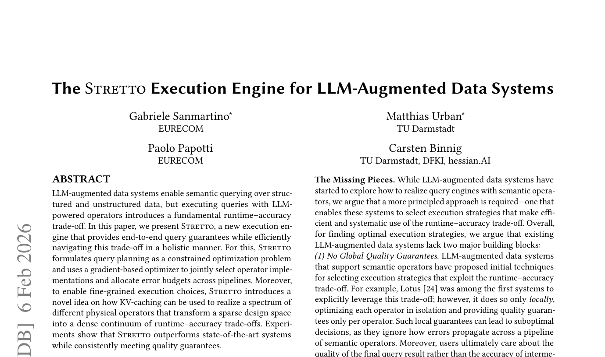
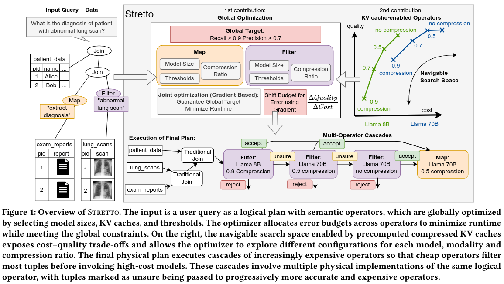

# STRETTO: a new execution engine for LLM-augmented data systems

Stretto makes the cost–accuracy search space significantly more navigable introducing a new physical operator layer, while providing explicit, end-to-end guarantees at the query level.
This is the implementation described in

> Gabriele Sanmartino, Matthias Urban, Paolo Papotti, and Carsten Binnig: "The Stretto Execution Engine for LLM-Augmented Data Systems.", arXiv preprint [[PDF]](https://arxiv.org/pdf/2602.04430)
>
> 
> 

## ⚙️ Setup

Use Python v3.13 or later.

```sh
# Export your OpenAI API key for query planning
export OPENAI_API_KEY=....

# Update the submodules
git submodule update --init --recursive

# Install dependencies and the package
pip install torch torchvision --index-url ...  # See https://pytorch.org/
pip install psutil
pip install flash-attn --no-build-isolation  # See https://github.com/Dao-AILab/flash-attention
cd kvpress && pip install -e . && cd ..  # installs modified kv-press. Forked from: https://github.com/NVIDIA/kvpress
pip install -r requirements.txt
pip install -e .

# On another terminal: Start the backend servers
# (open the script first to select which models to load on which GPUs)
bash scripts/start_servers.sh

# Optional: Run the demos
python demos/artwork.py
python demos/emails.py
python demos/real_estate.py
python demos/rotowire.py
```

## 🚀 Optimization experiments

```sh
# Run benchmarks
# Basic usage (requires a GPU device specification to run Stretto):
python scripts/run_benchmark.py --device cuda:0

# You can specify which approaches to run with --select-executors (optim_global = Stretto, abacus, lotus, optim_local, ...) 
# You can specify the datasets with --benchmarks (e.g. artwork_random_medium, movie_random, email_random, rotowire_random, ecommerce_random_large are used in the paper)
# Set precision and recall guarantees: --precision-guarantees / --recall-guarantees
# For example:
python scripts/run_benchmark.py --device cuda:0 --benchmarks artwork rotowire --select-executors optim_global lotus --precision-guarantees 0.7 0.9 --recall-guarantees 0.7 0.9

# To plot the results you can use our plotting script.
# The plots will appear in benchmark_results. For instance:
python scripts/plot_benchmark.py --benchmarks artwork_random_medium rotowire_random movie_random email_random ecommerce_random_large --approaches lotus optim_global

```

## 📊 Benchmarks

### 📁 Datasets

Here is how to obtain the data sets:

- Artwork: Already included, running an artwork query will automatically download the required images from Wikidata.
- Rotowire: Already included, see `reasondb/benchmarks/evaluation/files`
- Email: Running the benchmark will automatically run the Palimpzest Script to download the data set. See also the instructions of Palimpzest.
- Movies: Already included, see `reasondb/benchmarks/evaluation/files/movies_1000.csv`
- ecommerce: Download the dataset [here](https://sembench.ngrok.io/). We expect the following file structure <project-root>/SemBench/ecomm/1/fashion-dataset/...

### 🔍 Query Generation

Random queries are generated from predefined query shapes and operator options.
For each benchmark (i.e. artwork, rotowire, email, movie, ecommerce), you can find:

- **Query definitions and operator options**: `reasondb/evaluation/benchmarks/<benchmark_name>.py`
  - Example: `reasondb/evaluation/benchmarks/artwork.py`
  - Contains:
    - `ARTWORK_OPERATOR_OPTIONS`: List of possible operators (filters and extracts) that can be used in random query generation
    - `ARTWORK_QUERY_SHAPES`: Templates defining the structure of randomly generated queries (e.g., 2 operators, 3 operators)

- **Query generation**: The `RandomBenchmark` class (base class) generates queries by:
  1. Selecting a query shape (number and order of operators)
  2. Randomly sampling operators from the operator options
  3. Creating valid operator sequences following the shape template

## 🗜️ KV Cache Compression Experiments

To analyze the effects of KV cache compression on individual operators without query optimization, use the `run_benchmark_single_op_no_opt.py` script. This evaluates single-operator queries (filters and/or extracts) with various compression ratios. This script tests physical operators in isolation to understand quality-cost tradeoffs across different KV cache compression ratios.

**Basic usage:**

```sh
# Select the benchmark: --benchmark
# Run filter operators only (default)
# Run only extract operators: --only-extracts
# Run all operators (filters + extracts): --all-operators
# Specify which KV methods to compare: --kv-methods (e.g. `kv70B05` refers to 70B version of the model with compression ratio 0.5)

python scripts/run_benchmark_single_op_no_opt.py --benchmark artwork_random --all-operators --kv-methods kv70B05 kv70B00

```

## 📦 Other artifacts

- Artifacts from our runs are provided in benchmark_results

## 📖 Citation

If you use the code or the benchmarks of this repository, then please cite our paper:

```
@article{sanmartino2026stretto,
  title={The Stretto Execution Engine for LLM-Augmented Data Systems},
  author={Sanmartino, Gabriele and Urban, Matthias and Papotti, Paolo and Binnig, Carsten},
  journal={arXiv preprint arXiv:2602.04430},
  year={2026}
}
```
