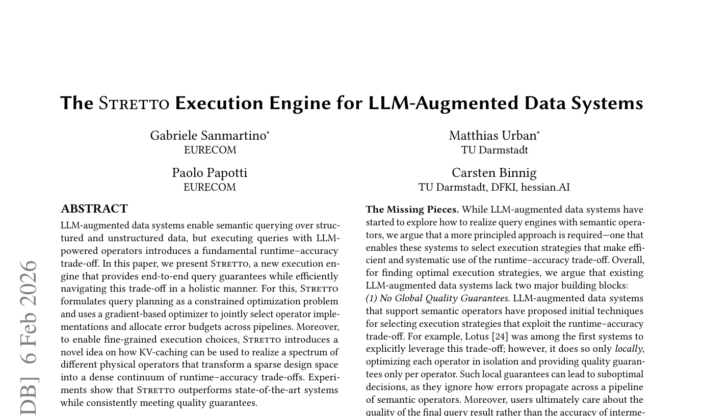
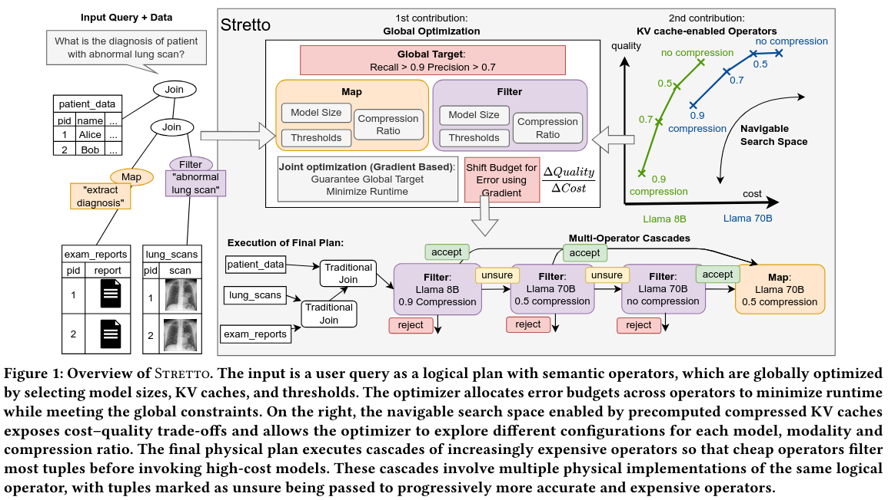

# STRETTO: a new execution engine for LLM-augmented data systems

Stretto makes the cost–accuracy search space significantly more navigable introducing a new physical operator layer, while providing explicit, end-to-end guarantees at the query level.
This is the implementation described in

> Gabriele Sanmartino, Matthias Urban, Paolo Papotti, and Carsten Binnig: "The Stretto Execution Engine for LLM-Augmented Data Systems.", arXiv preprint [[PDF]](https://arxiv.org/pdf/2602.04430)
>
> 
> 

## ⚙️ Setup

Use Python 3.12.

```sh
# OpenAI API key, used for query planning
export OPENAI_API_KEY=....

# Where datasets, KV caches and result caches go (default ~/.reasondb/cache).
# KV caches are large: point this at a disk with several hundred GB free.
export REASONDB_CACHE_DIR=/path/to/cache
# Model weights; the Llama models are gated, so log in to Hugging Face once
export HF_HOME=/path/to/hf_cache
hf auth login

# Submodules: our modified kvpress (forked from https://github.com/NVIDIA/kvpress) and palimpzest
git submodule update --init --recursive

pip install torch torchvision --index-url ...                 # see https://pytorch.org/
pip install flash-attn --no-build-isolation                   # see https://github.com/Dao-AILab/flash-attention
cd kvpress && pip install -e . && cd ..
pip install -r requirements.txt
pip install -e .
```

**Datasets.** Run everything from the repository root.

- Artwork, Rotowire, Movies: included (`reasondb/evaluation/benchmarks/files`); artwork images are downloaded from Wikidata on first use.
- Email: downloaded through palimpzest on first use.
- E-commerce: download the [SemBench dataset](https://sembench.ngrok.io/) into `SemBench/ecomm/1/fashion-dataset/...` under the repository root.

## 🚀 Running Stretto

Stretto calls models through local servers. Start them in a second terminal; environment
variables choose the GPUs (defaults at the top of each script):

```sh
# Text models only; start_servers_images.sh for the image models, start_servers_all.sh for both
TEXT_70B_GPUS=0,1 TEXT_8B_GPUS=2 EMBED_GPUS=2 bash scripts/start_servers_text.sh
```

The demos in `demos/` run single queries, e.g. `python demos/artwork.py`.

Experiments run through a **coordinator**, which turns a task into jobs and serves them as
a queue (port 5099), and one or more **workers**, which run the jobs. A worker starts the
model servers it needs itself:

```sh
# Terminal 1: the coordinator
python scripts/run_coordinator.py --producer run_benchmark --task-id my_run \
  --benchmarks artwork_random_medium rotowire_random \
  --select-executors optim_global lotus \
  --precision-guarantees 0.7 0.9 --recall-guarantees 0.7 0.9

# Terminal 2: a worker per machine; use the coordinator's host instead of localhost
# when they run on different machines
python scripts/run_worker.py --tasks my_run=http://localhost:5099 \
  --worker-id w0 --capability both --device cuda:0
```

- `--capability` is what the worker loads: `text`, `image`, `both`, `audio` or
  `embedding-only`. `both` starts `scripts/start_servers_all.sh`.
- `--select-executors` takes `optim_global` (Stretto), `lotus`, `abacus`, `optim_local`,
  `optim_shift_budget` and `no_optim`.
- `--local` runs the coordinator and one worker in one process (it needs `--device`, and
  the servers must already be running).
- Results go to `benchmark_results/<task-id>/`, merged into `merged/` once every job is
  done. A dashboard runs on port 5099 while a task is going (`--no-monitor` disables it).
- If a task ends with failed jobs, `python scripts/reset_failed_jobs.py <task-id> --apply`
  resets them, and restarting the coordinator runs them again.

## ♻️ Reproducing the paper's experiments

Each experiment is a **producer**: it fixes every axis it does not study and sweeps the one
it does.

| task | producer | paper result |
| --- | --- | --- |
| `base01` | `baselines` | Exp 1: Stretto against Lotus and Abacus |
| `mode01` | `baselines` | Exp 3: global against local optimization; appendix: number of semantic operators |
| `ops01` | `operator_count` | Exp 4: storage/runtime trade-off |
| `kvop01` | `kv_operator` | Exp 4: KV cache footprint against speedup |
| `samp01` | `sample_size` | Exp 5: profiling sample size |
| `abl01` | `ablation` | Exp 6: ablation table |
| `ref01` | `label_reference` | Appendix: human against model labels |

Exp 2 (KV cache–enabled operators) is the single-operator experiment described further
below.

**1. Generate the KV caches.** The sweeps visit every compression level of each model, so
generate them all first. Large models are sharded across all GPUs in
`CUDA_VISIBLE_DEVICES`, and a model whose caches are complete is skipped.

```sh
# Text: Llama-3.1-8B at 0.0/0.5/0.8, Llama-3.1-70B at 0.3/0.6/0.8
for b in rotowire_random movie_random_huge email_random ecommerce_random_large; do
  python scripts/generate_kv_cache.py --benchmark $b \
    --kv-methods kv8B00 kv8B05 kv8B08 kv70B03 kv70B06 kv70B08
done

# Images: LLaVA-8B at 0.0/0.5/0.9, LLaVA-72B at 0.5/0.9/0.99
for b in artwork_random_medium ecommerce_random_large; do
  python scripts/generate_kv_cache_image.py --benchmark $b \
    --kv-methods kv8B00 kv8B05 kv8B09 kv70B05 kv70B09 kv70B099
done
```

`ref01` needs no generated caches: it uses only the default operators, whose caches the
servers build on first use.

**2. Run each experiment** with a coordinator and a worker, as above. All but `ref01` run
on the five random benchmarks; `ref01` runs on the five curated ones by default.

```sh
BENCHMARKS="artwork_random_medium rotowire_random movie_random_huge email_random ecommerce_random_large"
python scripts/run_coordinator.py --task-id base01 --producer baselines --benchmarks $BENCHMARKS
python scripts/run_worker.py --tasks base01=http://localhost:5099 \
  --worker-id w0 --capability both --device cuda:0
```

The other experiments take the same two commands with these coordinator flags:

| task | coordinator flags |
| --- | --- |
| `base01` | `--producer baselines --benchmarks $BENCHMARKS` |
| `kvop01` | `--producer kv_operator --benchmarks $BENCHMARKS --state-plan kv_operator_marginal --precision-guarantees 0.5 0.7 0.9 --recall-guarantees 0.5 0.7 0.9` |
| `mode01` | `--producer baselines --benchmarks $BENCHMARKS --approaches optim_global optim_local optim_shift_budget --state-plan full --sample-sizes 150` |
| `ops01` | `--producer operator_count --benchmarks $BENCHMARKS` |
| `samp01` | `--producer sample_size --benchmarks $BENCHMARKS --sample-sizes 10 25 50 100 150` |
| `abl01` | `--producer ablation --benchmarks $BENCHMARKS --precision-guarantees 0.5 0.7 0.9 --recall-guarantees 0.5 0.7 0.9` |
| `ref01` | `--producer label_reference --precision-guarantees 0.5 0.7 0.9 --recall-guarantees 0.5 0.7 0.9` |

Run one coordinator at a time, or give each its own `--port`.

**3. Plot the results** with the commands in [The paper's figures](#-the-papers-figures),
leaving out `--results-root artifacts` (and pointing `plot_kvop.py` at your run with
`--kvops-dir benchmark_results/kvop01`).

## 📈 The paper's figures

[`artifacts/`](artifacts/) holds the results behind every figure and table, so all of them
redraw without a GPU or model server. Run from the repository root; the
`plot_sweep.py` commands share the prefix
`python scripts/plot_sweep.py --results-root artifacts`.

| Paper | Shows | Command |
| --- | --- | --- |
| Figure 5 (top) | accuracy vs. Lotus and Abacus | `… --experiment base01` |
| Figure 5 (bottom) | runtime vs. Lotus | `… --experiment base01 --exclude-arms abacus` |
| Figure 6 | KV profile quality vs. runtime | `python scripts/plot_quality_runtime.py --results-dir artifacts/single_operator --dataset email artwork --model llama llava` |
| Figure 7 | global vs. local optimization | `… --experiment mode01 --benchmarks ecommerce_random_large --no-overall --figures target-met metrics --metrics total_runtime` |
| Figure 8 | storage/runtime trade-off | `… --experiment ops01 --figures metrics --metrics total_runtime --annotate-minimum` |
| Figure 9 | KV cache footprint vs. speedup | `python scripts/plot_kvop.py kvop01 --target-ratio 0.7 0.9 --compact --metric total --aggregate geomean --speedup-bins 1.0 1.1 1.2 1.3` |
| Figure 10 | profiling sample size | `… --experiment samp01 --reference-from abl01` (left) and `… --experiment samp01` (right) |
| Table 1 | ablation | `python scripts/ablation_table.py --output-dirs artifacts/abl01/merged` (`--latex` for table rows) |
| Figure 11 | number of semantic operators | `… --experiment mode01 --facet-by num_semops --exclude-arms optim_local --width 2.96`, and again with `--figures metrics --metrics mean_total_runtime --pooling mean` |
| Figure 12 | human vs. model labels | `python scripts/plot_label_reference.py --output-dirs artifacts/ref01/merged --figures sections` (the paper adds one hand-drawn callout) |
| Figures 13, 14 | KV cache footprint by dataset size | `python reasondb/memory_footprint/kv_cache_footprint/plot_kv_cache_footprint.py` |

Each command logs the files it writes; `plot_sweep.py` writes into the task's `merged/`
directory unless `--figure-dir` says otherwise. Figure 11 as drawn here also contains a
panel for one-operator queries and a pooled panel, which the paper leaves out. The footprint CSVs beyond 1k items
are projections of the measured 1k-item sizes (`scale_footprint_csv.py`).

`plot_sweep.py` draws more than these figures: `--figures breakdown|target-met|metrics`,
`--metrics` (`total_runtime`, `execution_runtime`, `f1`, …), `--pooling geomean|sum`, and
narrowing flags such as `--benchmarks`, `--arms` and `--guarantees`; see
`python scripts/plot_sweep.py --help`.

## 🗜️ Single-operator KV cache experiment

This evaluates single operators in isolation (no query optimization) across KV
compression ratios: Exp 2 and its Figure 6. The paper's results are in
`artifacts/single_operator/`; pass `--output-dir` to the runners to write new ones
elsewhere and `--results-dir` to `plot_quality_runtime.py` to plot them.

```sh
# 1. Caches for each model under test (generate_kv_cache_image.py for image benchmarks)
python scripts/generate_kv_cache.py --benchmark movie_random \
  --kv-methods kv70B03 kv70B06 kv70B08 kv8B00 kv8B05 kv8B08

# 2. A server per model (kv_cache_image_qa_server.py for image models), plus the
#    text-embedding and image-similarity servers
python reasondb/backends/kv_cache_text_qa_server.py --model-name meta-llama/Llama-3.1-70B-Instruct &
python reasondb/backends/kv_cache_text_qa_server.py --model-name meta-llama/Llama-3.1-8B-Instruct &
bash scripts/start_servers_embedding_only.sh &

# 3. Run (run_benchmark_single_operator_image.py for image benchmarks, e.g. artwork_random)
python scripts/run_benchmark_single_operator.py --benchmark movie_random \
  --kv-methods kv70B03 kv70B06 kv70B08 vanilla70B --reference-method vanilla70B

# 4. Plot
python scripts/plot_quality_runtime.py --dataset movie --model llama
```

- `--kv-methods` names `kv<model><ratio>` (`kv70B05` = Llama-70B at ratio 0.5), or
  `vanilla<model>` for a full prefill without a stored cache. `--reference-method` is the
  method whose answers serve as labels and must be among `--kv-methods`.
- `--only-extracts` / `--all-operators` evaluate extracts only / filters and extracts
  (default: filters only).
- Other model families: `kvQwen72B`/`kvQwen7B`, `kvMistralSmall24B`/`kvMistral8B` (text),
  `kvLlava72B`/`kvLlava8B`, `kvQwenVL32B`/`kvQwenVL8B`, `kvMistralVL24B`/`kvMistralVL8B`
  (image); see `reasondb/config/model_registry.py`.

**Storing indices instead of one cache per ratio.** `generate_kv_caches_indices.py`
(`…_image_indices.py` for images) stores one baseline cache per model plus the kept-token
indices for higher ratios, which takes far less disk. Start the servers with
`--use-relative-indices` and run with `--materialized-cr <baseline ratio>`; models with
different baselines must be run separately.

## 🔁 Recording once, replaying many times

You can pre-compute model responses to simulate the experiments without running the models.

```sh
# Record (real models). One recording covers every candidate operator, so it serves all
# sweep experiments; ref01's curated datasets are recorded with --producer run_benchmark.
python scripts/run_coordinator.py --task-id pre01 --producer parameter_sweep \
  --precompute artwork_random_medium=artwork_precompute_kv.json \
               rotowire_random=rotowire_precompute_kv.json \
               movie_random_huge=movie_huge_precompute_kv.json \
               email_random=email_precompute_kv.json \
               ecommerce_random_large=ecomm_precompute_kv.json
python scripts/run_worker.py --tasks pre01=http://localhost:5099 \
  --worker-id w0 --capability both --device cuda:0

# Replay: the same coordinator flags as before, plus the stores
python scripts/run_coordinator.py --task-id base01 --producer baselines \
  --simulate artwork_random_medium=artwork_precompute_kv.json ...
python scripts/run_worker.py --tasks base01=http://localhost:5099 \
  --worker-id w0 --capability simulate --device cpu
```

Replays plan from the KV cache sizes recorded in `reasondb/evaluation/kv_cache_sizes.json`,
so they need no caches on disk either; the generators keep that file up to date, and
`scripts/measure_kv_cache_sizes.py` records caches produced otherwise. A re-run of a
precompute pass resumes where it stopped.

**Running all experiments on a cluster.** `scripts/cluster.yaml` lists the paper's
experiments with their flags and stores. `./scripts/start-configurators.sh` starts one
coordinator per experiment on its own node and `./scripts/start-workers.sh --nodes 7`
starts workers that drain them all (`--dry-run` prints what would run, `--experiments`
selects a subset).

## 🔍 Query generation

The random benchmarks generate their queries from predefined query shapes and operator
options, defined per benchmark in `reasondb/evaluation/benchmarks/<benchmark>.py` (e.g.
`ARTWORK_QUERY_SHAPES` and `ARTWORK_OPERATOR_OPTIONS` in `artwork.py`). The
`RandomBenchmark` base class picks a shape and fills it with randomly sampled operators.

## 📖 Citation

If you use the code or the benchmarks of this repository, then please cite our paper:

```
@article{sanmartino2026stretto,
  title={The Stretto Execution Engine for LLM-Augmented Data Systems},
  author={Sanmartino, Gabriele and Urban, Matthias and Papotti, Paolo and Binnig, Carsten},
  journal={arXiv preprint arXiv:2602.04430},
  year={2026}
}
```
